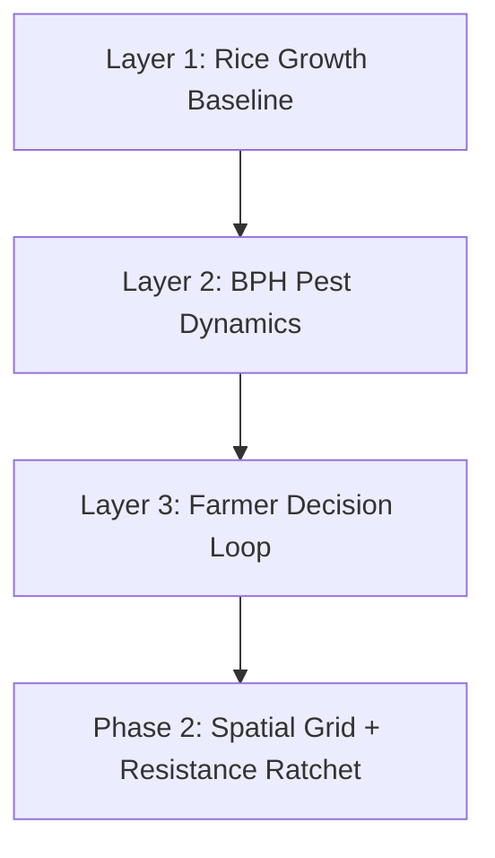

## Overview

This repository contains a modular agent-based simulation built in GAMA (GAma Modeling Language) to explore, calibrate, and validate crop-pest-farmer interactions. It acts as an isolated sandbox for testing Brown Planthopper (BPH) infestation dynamics and pesticide management policies before integration with the main STAR-FARM model.

The project uses a progressive three-layer architecture, extended in Phase 2 to a 3×3 spatial grid with pest diffusion and pesticide resistance ratcheting:

### 1. Layer 1: Rice Growth Baseline (`phase_1.gaml`)
* **Objective:** Establish a GDD thermal-time driven crop growth baseline in the absence of pests or farmer actions.
* **Mechanism:** Biomass accumulates daily based on RUE, solar radiation, and phase-specific fAPAR values. Crop harvests automatically at maturity.

### 2. Layer 2: BPH Pest Dynamics (`phase_1.gaml`)
* **Objective:** Introduce BPH pest pressure as a scalar `pest_load` on the plot to suppress crop yield, with stage-weighted vulnerability.
* **Mechanism:**
  * Weather-driven daily infection triggers (humidity, temperature, infection probability).
  * Stage-weighted damage multiplier ($k_{pest}$) reduces daily crop growth depending on growth phase — tillering is most vulnerable.
  * Natural decay applied in the off-season; `pest_load` resets to 0 at sowing.

### 3. Layer 3: Farmer Decision Loop (`phase_1.gaml`)
* **Objective:** Model pesticide spray decisions and track the farmer's economic outcomes.
* **Mechanism:**
  * Tracks a farmer budget (`money`).
  * Compares three strategies: **none** (no spray), **calendar** (fixed intervals), and **threshold** (Economic Injury Level style trigger).
  * Spray reduces `pest_load` by efficacy fraction (80% default) with a mandatory cooldown.

### 4. Phase 2: Spatial Grid + Resistance Ratchet (`phase_2.gaml`, `test_pest.gaml`)
* **Objective:** Extend the single-plot model to a 3×3 grid with localized pest seeding, spatial diffusion, and pesticide resistance buildup across seasons.
* **Mechanism:**
  * Pest originates at the center plot (1,1) and diffuses to von Neumann neighbors each cycle via synchronous 3-pass diffusion.
  * Resistance ratchet: each spray increments `resistant_fraction` by `selection_pressure_constant`, reducing `realized_efficacy = efficacy × (1 − resistant_fraction)` over time.
  * `test_pest.gaml` adds BPH sprite agents and a 4-color field display. Sprites are cosmetic only and do not affect model state.

---

## Baseline Parameters & Simulation Results

**Phase 1** — single plot, 3 seasons, fixed weather ($T_{mean} = 28°C$, $Humidity = 82\%$, $SolarRad = 18.0\ \text{MJ/m}^2\text{/day}$).

* **$T_{base}$:** $10.0°C$
* **$potential\_rue$:** $0.768\ \text{g/MJ}$ (OM5451, cultivars.csv)
* **$harvest\_index$:** $0.52$ (OM5451, cultivars.csv)
* **$efficacy$:** $0.8$
* **$spray\_cost$:** $100.0$ units/spray (placeholder)
* **$grain\_price$:** $3000.0$ units/t/ha (placeholder — relative rankings meaningful, absolute values are not)

### Strategy Comparison (avg across 3 seasons):

| Strategy | Grain Yield (t/ha) | Pest Loss (t/ha) | Sprays/season | End Money (S3) |
| :--- | :---: | :---: | :---: | :---: |
| **None** | 2.25 | 1.75 | 0 | 18,616 |
| **Calendar (14-day)** | 3.23 | 0.78 | 5 | 22,738 |
| **Threshold (0.30)** | 3.41 | 0.59 | 6–7 | 23,494 |

Baseline yield loss (none strategy): **43.75%**. Conservation check: (grain + pest_loss) / harvest_index ≈ 7.69–7.71 t/ha across strategies.

**Phase 2** — 3×3 grid, localized infection, 3 seasons. Season 1 spatial gradient (pest loss by plot position):

| Strategy | Center (1,1) | Neighbors avg | Corners avg |
| :--- | :---: | :---: | :---: |
| None | 1.18 t/ha | 0.58 | 0.33 |
| Calendar | 0.50 t/ha | 0.13 | 0.05 |
| Threshold | 0.73 t/ha | 0.39 | 0.23 |

Resistance at center plot by end of season 3: **0.30** (both calendar and threshold, 5 sprays/season). Grid-mean resistance: calendar 0.300 vs threshold 0.033 — targeted spraying contains resistance to one plot out of nine.