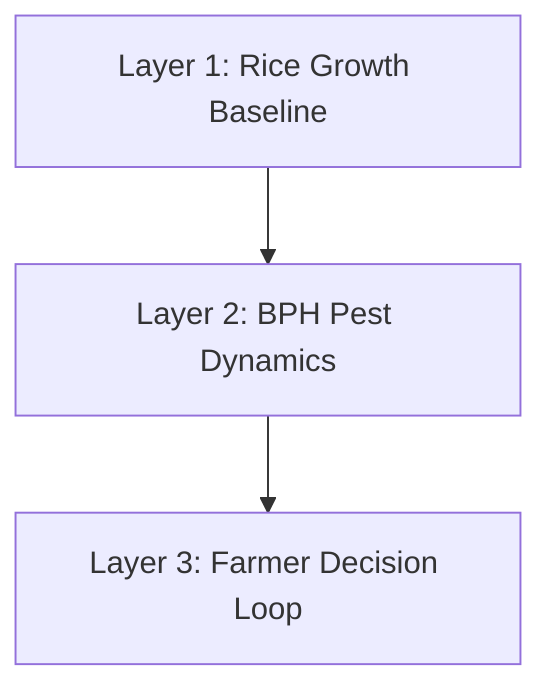

# Standalone Pest Management Model

**Author:** Joanne Maryz Cabatingan  
**Role:** Computer Science Intern at ACROSS  
**Objective:** Model pest dynamics and management strategies in a standalone agent-based simulation prior to integration with the main STAR-FARM model.

Detailed documentation on Pest Dynamics based on Literature, Assessment of current STAR-FARM models, and Standalone Model Design can be found in the working document.

---

## Overview

This repository contains a modular agent-based simulation built in GAMA (GAma Modeling Language) to explore, calibrate, and validate crop-pest-farmer interactions. It acts as an isolated sandbox for testing Brown Planthopper (BPH) infestation dynamics and pesticide management policies.

The project uses a progressive three-layer architecture:

### 1. [Layer 1: Rice Growth Baseline](Pest-Management-Module/models/PestModule_Layer1.gaml)
* **Objective:** Establish a GDD (Growing Degree Days) thermal-time driven crop growth baseline in the absence of pests or farmer actions.
* **Mechanism:** Biomass accumulates daily based on RUE (Radiation Use Efficiency), solar radiation, and phase-specific fAPAR values. Crop harvests automatically at maturity.

### 2. [Layer 2: BPH Pest Dynamics](Pest-Management-Module/models/PestModule_Layer2.gaml)
* **Objective:** Introduce BPH pest pressure as a scalar `pest_load` on the plot to suppress crop yield, with stage-weighted vulnerability.
* **Mechanism:** 
  * Weather-driven daily infection triggers (based on humidity, temperature, and infection probability).
  * Stage-weighted damage multiplier ($k_{pest}$) reduces daily crop growth depending on growth phase (tillering is most vulnerable).
  * Natural decay is applied in the off-season, and `pest_load` is reset to 0 at sowing.

### 3. [Layer 3: Farmer Decision Loop](Pest-Management-Module/models/PestModule_Layer3.gaml)
* **Objective:** Model pesticide spray decisions and track the farmer's economic outcomes.
* **Mechanism:** 
  * Tracks a farmer budget (`money`).
  * Compares three strategies: **none** (no spray), **calendar** (fixed intervals), and **threshold** (Economic Injury Level style trigger).
  * Spray applications reduce `pest_load` by a sub-100% efficacy fraction (80% by default) and incur a safety cooldown.

---

## Baseline Parameters & Simulation Results

The simulation runs on a single plot over 3 seasons under identical, constant weather ($T_{mean} = 28^\circ\text{C}$, $Humidity = 82\%$, $SolarRad = 18.0 \text{ MJ/m}^2/\text{day}$). 

* **$T_{base}$:** $10.0^\circ\text{C}$  
* **$potential\_rue$:** $0.77 \text{ g/MJ}$  
* **$efficacy$:** $0.8$ (80% pest reduction per spray)  
* **$spray\_cost$:** $100.0$ units/spray  

### Strategy Comparison Results:

| Scenario | Grain Yield (t/ha) | Pest Loss (t/ha) | Sprays | End Money (units) |
| :--- | :---: | :---: | :---: | :---: |
| **No Pest (Layer 1)** | 6.31 | 0.00 | — | — |
| **No Spray (Layer 2)** | 3.59 | 2.71 | 0 | 5000 |
| **Calendar (14-day)** | 5.16 | 1.15 | 4 | 4600 |
| **Threshold (0.30)** | 5.37 | 0.93 | 6 | 4400 |

---

## How to Run the Simulation

1. **Import the Project:**
   * Open the GAMA Platform (v1.8.2 or 1.9+).
   * Select `File -> Import -> Projects... -> Existing Projects into Workspace`.
   * Choose the `Pest-Management-Module` folder in this repository.
2. **Run Experiments:**
   * Open any model file in the `models/` directory:
     * `PestModule_Layer1.gaml`
     * `PestModule_Layer2.gaml`
     * `PestModule_Layer3.gaml`
   * Click the `experiment` run it.
